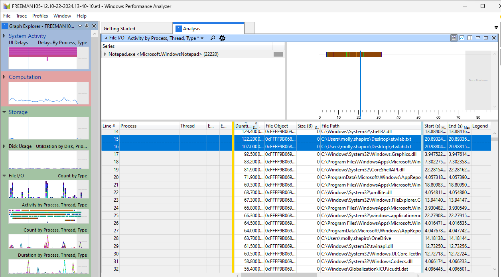

# Event Tracing for Windows

## Lecture Notes: Event Tracing for Windows (ETW)

### Event Tracing for Windows

* high speed tracing facility built into Windows which is using a buffering and logging mechanism implemented directly into the OS kernel
* infrastructure for events raised by both user mode (apps) and kernel mode components (drivers)
* originally made for devs to see app performance and for debugging
* EDR systems utilize ETW
  * doesn't downgrade the performance of your system

### ETW Architecture

* major components and responsibilities:
  * providers: generate ETW events (ex. drivers, applications, Windows kernel)
  * controllers: start/stop/configure the logging
  * consumers: logging, analyzing, or processing the events
  * sessions: records events from provider(s)

### Artifacts: Location and Type

* location: no specific location
* file type: stored on disk end with the .etl (Event Trace Logging) extension

### Forensic Value of ETW

* system and app diagnosis
* troubleshooting
* performance monitoring
* detection

### Tools&#x20;

#### logman

* creates and manages Event Trace Session and Performance logs and supports many functions of Performance Monitor from the command line

#### PerfView

* a free performance analysis tool that helps isolate CPU and memory-related performance issues

#### Windows Performance Recorder and Windows Performance Analyzer

* WPR
  * used to record sessions
* WPA
  * used to analyze recorded sessions

#### EtwExplorer

* view ETW provider metadata
  * GUID

## Lab Notes: Event Tracing For Windows

### WKS01

* [Download WPA](https://learn.microsoft.com/en-us/windows-hardware/test/wpt/windows-performance-analyzer)
  * leave default settings
* Run WPR
  * if receiving a "Hot Key is already registered" error, click OK and proceed
  * expand "Record system information -> Resource Analysis" and select "File I/O activity", then click start
* create a Notepad file called etwlab.txt and add some content, then save
* hit Save in WPR and save the .etl file, then click "Open in WPA"
* Storage -> File I/O -> Double click Activity by Process, Thread, Type -> Series window -> Notepad.exe -> Right Click -> Filter to Window -> can search for file name in Series window

<figure><figcaption></figcaption></figure>

### PerfView

* [Download PerfView](https://github.com/microsoft/perfview)
  * Releases -> Assets -> PerfView.exe
* Open PerfView
* Change file directory to where the .etl file is saved and double-click
* Processes / Files / Registry Stacks -> Use Microsoft Symbol Server -> Go to "By Name" tab -> double click on Notepad entry
* Events -> Windows Kernel/FileIO/Create -> Search in Text Filter

<figure><figcaption></figcaption></figure>

<figure><figcaption></figcaption></figure>

### logman

* open admin Powershell

```
logman query providers
# all the providers that come default on the system
logman query providers [provider name]
# gives provider name, GUID
logman query providers {GUID}
# same result as provider name
logman query providers | Select-String Powershell
logman query providers Microsoft-Windows-Powershell
logman create trace mytrace1 -ets
logman query mytrace1 -ets
logman update mytrace1 -p Microsoft-Windows-Kernel-Process 0x50 -ets
logman update mytrace1 -p Microsoft-Windows-Kernel-Process 0x1100 -ets
logman query mytrace1 -ets
logman create trace mytrace2 -ets
logman update mytrace2 -p Microsoft-Windows-Powershell 0x80000000000000A3 -ets
logman query -ets
logman stop mytrace1 -ets
logman stop mytrace2 -ets
```

* info contained in logman provider query:
  * values
    * process
      * a container for threads
      * points to an EXE or DLL to be loaded
    * threads
      * tied to a process- thread IDs are only unique within its process
    * image
      * an EXE or DLL loaded into memory is an image
    * if you want several keywords, add their values together
      * if you want process and thread, the value is 50
        * the system starts with the largest value it can fit in the value you can provide (in this case, 40), then looks for the next largest value it can fit with what's left (in this case, 10), and continues until it's done
* via PerfView, Events -> Microsoft-Windows-Kernel-Process/ImageLoad is where to look for EXEs or DLLs that were loaded to memory
