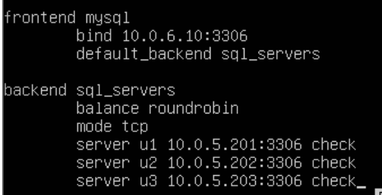

# Network Redundancy

## Lecture Notes: Availability and Redundancy

### CIA Triad

* confidentiality and integrity are what most labs up to this point have focused on
  * encryption in transit, encryption at rest, access control, hashing
* focus now is availability

### Threats to Availability

* availability is crucial for systems that provide resources to people
  * company resources affect function- can affect business costs, either internally or externally
* threats to availability: denial of service, threat actors downing or removing systems and tools, ransomware, hardware malfunction
* Crowdstrike, Sony, etc.

### Risk Analysis

* redundancy is expensive
* disaster recovery site options
  * hot- \$$$
  * warm- \$$
  * cold- $
* types of failover sites
  * hot- critical systems that cannot go down
  * warm- the resource going down is a problem, but not critical
  * cold- can tolerate the resource being down
* disaster recovery means:
  * data- replication, offsite backup
    * cloud environment isn't really an offsite backup- they're still connected to your environment (which means threat actors can jump to them)
  * networks- high availability options, double
  * people
    * who goes to backup sites
    * who is critical personnel

### Availability

* availability = normal operation time / total time
* 99% availability means almost 88 hours of down time in a year

### Cloud Providers

* pros:
  * decreased cost
  * ease of access (generally)
* cons:
  * another point of failure

## Lecture Notes: First Hop Redundancy Protocols

### Default Gateway Limitations

* end devices are typically configured with a single default gateway IPv4 address
  * if the default gateway router interface fails, LAN hosts lose outside LAN connectivity
  * occurs even if a redundant router or layer 3 switch that could serve as a default gateway exists
* first hop redundancy protocols are mechanisms that provide alternate default gateways in switched networks where two or more routers are connected to the same VLANs

### Router Redundancy

* one way to prevent a single point of failure at the default gateway is to implement a virtual router
  * multiple routers are configured to work together to present the illusion of a single router to the hosts on the LAN
  * by sharing an IP and MAC address, two or more routers can act as a single virtual router
  * the IPv4 address of the virtual router is configured as the default gateway for the workstations on a specific IPv4 segment
  * hosts use ARP to resolve the MAC address that is associated with the IPv4 address of the default gateway
    * the ARP resolution returns the MAC address of the virtual router
* a redundancy protocol provides the mechanism for determining which router should take the active role in forwarding traffic
  * also determines when the forwarding role must be taken over by a standby router
  * the transition from one forwarding router to another is transparent to the end devices
  * the ability of a network to dynamically recover from the failure of a device acting as a default gateway is known as first-hop redundancy

### Steps for Router Failover

* when the active router fails, the redundancy protocol transitions the standby router to the new active router role
* these are the steps that take place when the active router fails:
  * the standby router stops seeing Hello messages from the forwarding router
  * the standby router assumes the role of the forwarding router
  * there is no interruption for the hosts

### Virtual Router Redundancy Protoco

* communicates using hello protocol
* sends advertisements to multicast address using 224.0.0.18
* uses IP protocol 112
* communicates using virtual MAC address 0000.5e00.01xx where xx is the group number
* VRRP advertisements are sent at 1 second intervals
* one is elected as the master router, while all others are backups
* master is elected by the router with the highest priority
* VRRP preemption is enabled by default
  * returns priority to the master router when it comes back online
* no tracking mechanism in VRRP

### HSRP Priority and Preemption

* Cisco Proprietary but similar to VRRP

## Project 1: Network Redundancy

### Project Info

* redundant vyos routers
  * the 2 routers can share the same IPs so that if one fails, no reconfiguration or convergence is required
  * VRRP (virtual router redundancy protocol) will be used
  * port forwarding will also help meet the redundancy requirements
* set up 2FA on SSH on the web server
* note: a host can only recognize one default gateway, which is why a virtual IP is necessary

### Lab Setup

* snapshot all hosts in vCenter before starting

### VYOS01

* configure network adapters

<figure><figcaption></figcaption></figure>

```
configure
set system host-name vyos01-shapiro
set system login user [username] authentication plaintext-password [password]
commit
save
exit
exit
# log back in again
configure
show interfaces
set interfaces ethernet eth0 description SEC440-WAN
set interfaces ethernet eth1 description SEC440-LAN
set interfaces ethernet eth2 description SEC440-OPT
commit
save
show interfaces
set interfaces ethernet eth0 address 10.0.17.23/24
set interfaces ethernet eth1 address 10.0.5.2/24
set interfaces ethernet eth2 address 10.0.6.2/24
commit
save
show interfaces
set protocols static route 0.0.0.0/0 next-hop 10.0.17.2
set system name-server 10.0.17.2
commit
save
ping -c1 google.com
set nat source rule 10 description "NAT FROM LAN TO WAN"
set nat source rule 10 outbound-interface eth0
set nat source rule 10 source address 10.0.5.0/24
set nat source rule 10 translation address masquerade
commit
save
show nat source rule 10
set nat source rule 20 description "NAT FROM OPT TO WAN"
set nat source rule 20 outbound-interface eth0
set nat source rule 20 source address 10.0.6.0/24
set nat source rule 20 translation address masquerade
commit
save
show nat source rule 20
```

### VYOS2

* configure network adapters

<figure><figcaption></figcaption></figure>

```
configure
set system host-name vyos02-shapiro
set system login user [username] authentication plaintext-password [password]
commit
save
exit
exit
# log back in again
configure
show interfaces
set interfaces ethernet eth0 description SEC440-WAN
set interfaces ethernet eth1 description SEC440-LAN
set interfaces ethernet eth2 description SEC440-OPT
commit
save
show interfaces
set interfaces ethernet eth0 address 10.0.17.83/24
set interfaces ethernet eth1 address 10.0.5.3/24
set interfaces ethernet eth2 address 10.0.6.383/24/24
commit
save
show interfaces
set protocols static route 0.0.0.0/0 next-hop 10.0.17.2
set system name-server 10.0.17.2
commit
save
ping -c1 google.com
set nat source rule 10 description "NAT FROM LAN TO WAN"
set nat source rule 10 outbound-interface eth0
set nat source rule 10 source address 10.0.5.0/24
set nat source rule 10 translation address masquerade
commit
save
show nat source rule 10
set nat source rule 20 description "NAT FROM OPT TO WAN"
set nat source rule 20 outbound-interface eth0
set nat source rule 20 source address 10.0.6.0/24
set nat source rule 20 translation address masquerade
commit
save
show nat source rule 20
```

### XUbuntu-WAN

* check network adapters

<figure><figcaption></figcaption></figure>

```
sudo adduser shapiro
sudo usermod -aG sudo shapiro
sudo nmtui
# set hostname to xubuntu-wan
# set networks - see screenshot
reboot
can now ping 8.8.8.8 (not google.com- DNS forwarding is not set up yet)
```

<figure><figcaption><p>xubuntu-wan networking</p></figcaption></figure>

### XUbuntu-LAN

* change network adapters

<figure><figcaption></figcaption></figure>

```
sudo adduser shapiro
sudo passwd shapiro
sudo usermod -aG wheel shapiro
sudo nmtui
# set hostname
# set network
reboot
ping -c1 8.8.8.8
```

<figure><figcaption><p>xubuntu-lan networking</p></figcaption></figure>

### WEB01

* change network adapter

<figure><figcaption></figcaption></figure>

```
sudo adduser shapiro
sudo passwd shapiro
sudo usermod -aG wheel shapiro
sudo nmtui
# set hostname
# set network
reboot
ping -c1 8.8.8.8
sudo yum install httpd
sudo nano /var/www/html/index.html
sudo systemctl enable httpd
sudo systemctl start httpd
sudo firewall-cmd --add-port=80/tcp --permanent
sudo firewall-cmd --reload
```

<figure><figcaption><p>web01 networking</p></figcaption></figure>

### Configuring VRRP

```
# run on both vyos1 and vyos2
set high-availability vrrp group WAN vrid 10
set high-availability vrrp group WAN interface eth0
set high-availability vrrp group WAN address 10.0.17.113/24
set high-availability vrrp group LAN vrid 20
set high-availability vrrp group LAN address 10.0.5.1/24
set high-availability vrrp group LAN interface eth1
set high-availability vrrp group OPT vrid 30
set high-availability vrrp group OPT interface eth2
ste high-availability vrrp group OPT address 10.0.6.1/24
commit
save
run show vrrp
```

### Changing Network Configurations

#### WEB01

<figure><figcaption></figcaption></figure>

#### xubuntu-lan

<figure><figcaption></figcaption></figure>

### Additional Firewall Configuration

```
# vyos1 and vyos2
set service dns forwarding listen-address 10.0.5.1
set service dns forwarding allow-from 10.0.5.0/24
commit
save
set service dns forwarding listen-address 10.0.6.1
set service dns forwarding allow-from 10.0.6.0/24
commit
save
set nat destination rule 10 description "HTTP WEB01"
set nat destination rule 10 destination port 80
set nat destination rule 10 inbound-interface eth0
set nat destination rule 10 protocol tcp
set nat destination rule 10 translation address 10.0.5.100
set nat destination rule 10 translation port 80
commit
save
set nat destination rule 20 description "SSH WEB01"
set nat destination rule 20 destination port 22
set nat destination rule 20 inbound-interface eth0
set nat destination rule 20 protocol tcp
set nat destination rule 20 translation address 10.0.5.100
set nat destination rule 20 translation port 22
commit
save
```

### Installing and Configuring SSH

#### xubuntu-WAN

```
ssh-keygen -t rsa
ssh-copy-id shapiro@10.0.17.113
```

#### web01

```
systemctl status sshd
sudo nano /etc/ssh/sshd_config
# change PermitRootLogin to no
sudo dnf install epel-release
sudo dnf install google-authenticator qrencode qrencode-libs
google-authenticator -s ~/.ssh/google_authenticator
restorecon -Rv ~/.ssh/
sudo cp /etc/pam.d/sshd /etc/pam.d/sshd.bak
sudo nano /etc/pam.d/sshd
# add in auth [tab] required [tab] pam_google_authenticator.so secret=/home/${USER}/.ssh/google_authenticator nullok
# add in auth [tab] required [tab] pam_permit.so
sudo cp /etc/ssh/sshd_config /etc/ssh/sshd_config.bak
sudo nano /etc/ssh/sshd_config
# change ChallengeResponseAuthentication to yes
sudo systemctl restart sshd
sudo nano /etc/ssh/sshd_config
# add AuthenticationMethods publickey,password publickey,keyboard-interactive
sudo nano /etc/pam.d/sshd
# comment out auth substack password-auth
sudo systemctl restart sshd
```

### Resources

