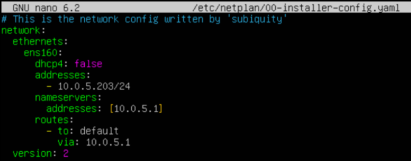

# Web Application and Database Redundancy

## Lecture Notes: Standard Replication and Galera Cluster

### Purpose and Advantages of Replication

#### Standard Replication for Maintenance

* backups
  * continuous
  * without locking tables (no performance drain)
* upgrades and schema changes
  * set slave to read-only&#x20;
  * make slave master
* redirect traffic away from master to slave - new master
* apply changes to original master
* redirect traffic back to master

#### Standard Replication for High Availability

* master fails
  * network outage
  * physical problems
* swappable database servers
  * redirect traffic to slave

#### Replication for Load Balancing

* distribute read traffic
  * move slow, heavy queries to slave
* redirect for maintenance
  * take slave offline for backups
  * direct away from failed servers
  * redirect traffic while upgrading

#### Enhanced Replication with Galera Cluster

* multiple masters
* transactional
* writes
  * conflict detection and resolution upon commit
  * nodes isolated easily
* seamlessly remove and add servers
  * automatic provisioning

### Option 1: Standard Replication

#### Standard Replication: Basic Replication Elements and Process

* master
  * handles client writes (possibly also reads)
  * daemon sends writes to storage engines
  * write queries recorded in binary log
  * sends binary log entries to slave (when asked)
* slaves
  * handles only client reads
  * queries master for binary log entries writes to storage engines and relay log

### Configuring Standard Replication

#### Standard Replication: Replication Threads

* master dump thread
  * sends binary log entries to slave
* slave IO thread
  * requests and receives master binary log entries
  * writes entries to its relay lg
* slave SQL thread
  * reads relay log and executes queries locally
  * checks query result codes match master
* multiple execution threads on slave
  * separate entries by database
  * updates applied in parallel (not sequence)

#### Standard Replication: Replication Files

* master binary log files
  * master records write to file
  * rotated when flushed or periodically to new log file
* slave relay log file
  * log of master binary log entries rotated periodically or when flushed
* replication configuration stored in master.info (slave)
* name of relay log file in relay-log.info (slave)

### Option 2: Galera Cluster

#### Galera Cluster Features

* virtual synchronous replication
* true multi-master solution
* almost no slave lag
* conflict detection and resolution on commit
* easy maintenance
  * automatic provisioning
  * node isolation
  * rolling upgrades

#### Data Centric

* data doesn't belong to a node, node belongs to data
* data is synchronized among multiple nodes
* galera nodes are anonymous (equal)
* galera cluster is a distributed master

#### Node Provisioning Tool

* state transfers for new nodes
  * State Snapshot Transfer (SST)
  * Incremental State Transfers (IST)
* methods for state transfers
  * logical- mysqldump
  * physical- rsync

## Project 3 Notes

### Configuring Ubuntu Database Servers

* snapshot
* change network adapter to LAN

<figure><figcaption></figcaption></figure>

<figure><figcaption></figcaption></figure>

<figure><figcaption></figcaption></figure>

<pre><code>sudo adduser shapiro
sudo usermod -aG sudo shapiro
sudo hostnamectl set-hostname u1-shapiro/u2-shapiro/u3-shapiro
sudo nano /etc/netplan/00-installer-config.yaml
sudo netplan apply
reboot
sudo apt-get update
sudo apt-get install mariadb-server
<strong>sudo systemctl start mariadb
</strong>sudo systemctl enable mariadb
</code></pre>

<figure><figcaption><p>/etc/netplan/00-installer-config.yaml for u1-shapiro</p></figcaption></figure>

<figure><figcaption><p>/etc/netplan/00-installer-config.yaml for u2-shapiro</p></figcaption></figure>

<figure><figcaption><p>/etc/netplan/00-installer-config.yaml for u3-shapiro</p></figcaption></figure>

### Configuring Galera

```
sudo systemctl stop mariadb
sudo nano /etc/mysql/mariadb.conf.d/60-galera.cnf
sudo nano /etc/mysql/mariadb.conf.d/50-server.cnf
# change bind-address to 0.0.0.0
sudo apt install rsync
# when done, only on u1-shapiro
sudo galera_new_cluster
# on u2 and u3
sudo systemctl start mariadb
# on all
sudo mariadb-secure-installation
mysql -u root -p
CREATE USER 'webuser'@'10.0.6.11' IDENTIFIED BY '[password]';
GRANT ALL PRIVILEGES ON PETS.* to 'webuser'@'10.0.6.11' IDENTIFIED BY '[password];'
CREATE USER 'webuser'@'10.0.6.12' IDENTIFIED BY '[password]';
GRANT ALL PRIVILEGES ON PETS.* to 'webuser'@'10.0.6.12' IDENTIFIED BY '[password];'
```

<figure><figcaption><p>60-galera.cnf on u1</p></figcaption></figure>

<figure><figcaption><p>60-galera.cnf on u2</p></figcaption></figure>

<figure><figcaption><p>60-galera.cnf on u3</p></figcaption></figure>

### Configuring HAProxy for Galera Cluster

#### HA1 and HA2

```
sudo nano /etc/haproxy/haproxy.cfg
sudo systemctl restart haproxy
```

<figure><figcaption><p>addition to /etc/haproxy/haproxy.cfg on ha1 and ha2</p></figcaption></figure>

### Web Application Setup: WEB01 and WEB02

```
sudo dnf install php
sudo dnf install php-mysqlnd php-gd php-intl
sudo systemctl restart httpd
sudo dnf install mariadb
sudo nano birthday.html
sudo nano birthday.php
sudo nano submit.html
sudo nano submit.php
# on WEB01
scp file.html/php shapiro@10.0.5.101:~ (for all new web server files)
# on WEB02
sudo cp ~/* /var/www/html/
# on both
sudo systemctl restart httpd
sudo setsebool -P httpd_can_network_connect_db on
```

## Reflection

Problem 1: MariaDB users are created using plaintext passwords and are logged into using plaintext passwords. The passwords are not stored in plaintext, but they can be seen in the terminal history. This allows for easy access to the SQL database if access to the host user is gained.&#x20;

<figure><figcaption><p>encoded password stored in mariadb</p></figcaption></figure>

Solution: Enable 2FA with auth\_option settings as defined in the MySQL documentation, and create a MySQL-compatible hash to assign directly to the user as defined in the Server Fault discussion. (An alternative to this step could be utilizing the RANDOM PASSWORD option in MySQL.) The steps to this would be:

1. Choose password.
2. Use Python script from Server Fault discussion to generate a MySQL password hash based off of that password. I would also recommend modifying the script to generate a random password, which could be saved to a secure file to later be deleted or printed once to the console.
3. Copy the hash generated and use it in the CREATE USER function as follows: CREATE USER "username" IDENTIFIED BY "password hash" AND auth\_plugin, where auth\_plugin is the additional chosen 2FA option.





Problem 2: MariaDB credentials are passed in plaintext in the web server PHP files, giving remote access to the SQL databases if the web server is compromised.&#x20;

Solution: Protect the PHP file with the passwords in the following ways. Based on research, it seems that there is no alternative to plaintext credentials being passed through PHP to the SQL database, but there are ways to protect the file with the plaintext credentials.

1. Store the password outside of the web root directory (usually /var/www/html). This makes it more difficult for threat actors to access the file through methods like directory traversal, especially when many web hosting methods have anti-directory traversal safeguards in place to disallow navigating outside of the web root directory from the webpage.
2. Use separation of permissions and the principle of least privilege by creating separate MariaDB users for each use case that only have access to the resources they need, and nothing else.
3. Give each user a unique password with no logical connection to other users' passwords.
4. Change the password regularly and follow password restrictions (like identified in the previous problem and solution).&#x20;



Problem 3: There is no file replication in place for the two Apache servers. HAProxy serves as a load balancer, but it does not copy files between Apache servers.&#x20;

Solution: Use LSyncD on the web root directory (/var/www/html) to watch for changes and sync them with rsync, as seen below:

```
sudo yum install lsyncd
sudo yum install rsync
sudo nano /root/vhostsync.sh
# create script to periodically reload HTTPD
sydo nano /etc/lsyncd.conf
# modify configuration file to specify source and target directories, as well as hosts and the vhostsync.sh script
sudo systemctl enable lsyncd
sudo systemctl start lsyncd
```


