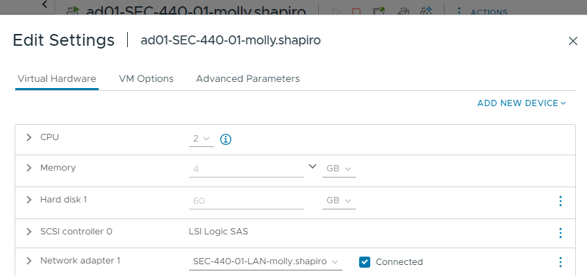
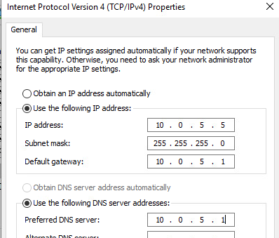
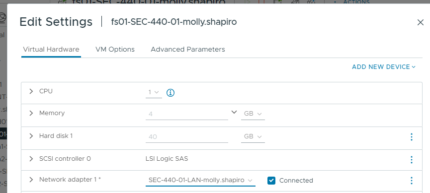
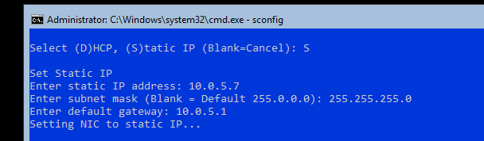

# Windows Admin Center

## Lecture Notes: Windows Admin Center

### What is Windows Admin Center?

* a locally-deployed, browser-based management tool set that lets you manage your Windows clients, servers, and clusters without needing to connect to the cloud
* gives you full control over all aspects of your server infrastructure and is particularly useful for managing servers on private networks that are not connected to the Internet
* the modern evolution of in-box management tools like Server Manager and MCC
  * complements System Center, but isn't a replacement

### How Does WAC Work?

* install on a server/workstation (NOT on a DC)
  * free download
  * access via browser

### Installation Types

* local client
  * install on a local windows 10 client that has connectivity to the managed servers
  * great for quick start, testing, ad-hoc, or small scale scenarios
* gateway server
  * install on a designated gateway server and access from any client browser with connectivity to the gateway server
  * great for large-scale scenarios
* managed server
  * install directly on a managed server for the purpoes of remotely managing the server or a cluster in which it is a member node
  * great for distributed scenarios
* failover cluster
  * deploy in a failover cluster to enable high availability of the gateway service
  * great for production environments to ensure resiliency of your management service

### Extensions

* WAC is built as an extensible platform
  * enable partners and devs to leverage existing capabilities within WAC
  * integrate with other IT admin products and solutions
  * each tool in WAC is built as an extension

### WinRM

* Windows Remote Management
* enables connections between computers or servers so that remote operations can be performed
* can obtain data or manage resources on remote computers as well as the local computer
* connecting to a remote computer in a WinRM script is very similar to making a local connection
* the WinRM service starts automatically on servers since 2008
* however, by default, WinRM listener may not be configured, even if WinRM is running
  * Windows Defender may block ports
  * Windows 10/11 needs some help to be managed by WAC

## Lab Notes: VM Cleanup

### VYOS01

```
delete high-availability vrrp group WAN
delete high-availability vrrp group LAN
delete high-availability vrrp group OPT
delete interfaces ethernet eth1 address 10.0.5.2/24
delete interfaces ethernet eth2 address 10.0.6.2/24
set interfaces ethernet eth1 address 10.0.5.1/24
set interfaces ethernet eth2 address 10.0.6.1/24
```

### AD01 Configuration

* snapshot
* switch network adapter to LAN

<figure><figcaption></figcaption></figure>

* sconfig: make sure updates are turned to Manual
* Network and Internet Settings -> Network and Sharing Center -> Ethernet -> Properties -> IPv4 -> Properties

<figure><figcaption></figcaption></figure>

* Settings -> System -> About -> Rename this PC

```
Install-WindowsFeature AD-Domain-Services -IncludeManagementTools
Install-ADDSForest -DomainName shapiro.local
```

* Server Manager -> Tools -> Active Directory Users and Computers -> shapiro.local -> New -> User
  * Add to group -> Domain Admin
* Server Manager -> Tools -> DNS -> Reverse Lookup Zones -> New Zone

### FS01 Configuration

* snapshot
* change network adapter to LAN

<figure><figcaption></figcaption></figure>

* sconfig
  * Network Settings
    * IP address
    * DNS server
  * hostname
  * join domain

<figure><figcaption></figcaption></figure>

<figure><figcaption></figcaption></figure>

### Configuring WKS01

* Network and Internet Settings -> Network and Sharing Center -> Ethernet -> Properties -> IPv4 -> Properties

<figure><figcaption></figcaption></figure>

* Settings -> System -> About -> Rename this PC
* Settings -> System -> Accounts -> Access work or school -> Join this device to a local Active Directory domain

### Windows Admin Center - FS01

```
powershell
Invoke-WebRequest 'http://aka.ms/WACDownload' -OutFile WAC.msi
msiexec /i WAC.msi /qn /L*v log.txt SME_PORT=443 SSL_CERTIFICATE_OPTION=generate
```

### Additional Tasks

#### Configuring WAC

* Settings -> Extensions -> Active Directory -> Install
  * DNS -> Install

#### Installing Chrome on AD

```
$Path = $env:TEMP; $Installer = 'chrome_installer.exe'; Invoke-WebRequest -Uri 'http://dl.google.com/chrome/install/375.126/chrome_installer.exe' -OutFile $Path\$Installer; Start-Process -FilePath $Path\$Installer -Args '/silent /install' -Verb RunAs -Wait; Remove-Item -Path $Path\$Installer
```

#### Remote Management for WKS01

```
winrm quickconfig
```

